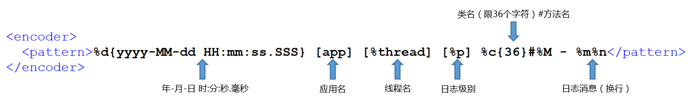

# Java 日志规范

> 本文基于[阿里巴巴Java开发手册](https://yq.aliyun.com/attachment/download/?id=4942)日志规约章节，结合自己的开发经验做了一些增删和调整。

1. 【强制】应用中不可直接使用日志系统（Log4j、Logback）中的API，而应依赖使用日志框架SLF4J中的API，使用门面模式的日志框架，有利于维护和各个类的日志处理方式统一。

```java
import org.slf4j.Logger;
import org.slf4j.LoggerFactory;
private static final Logger logger = LoggerFactory.getLogger(Abc.class);
```

2. 【强制】日志文件推荐至少保存 `30` 天，因为有些异常具备以“周”为频次发生的特点。

3. 【强制】应用中的扩展日志（如打点、临时监控、访问日志等）命名方式：`appName_logType_logName.log`。logType:日志类型，推荐分类有stats/desc/monitor/visit等；logName:日志描述。这种命名的好处：通过文件名就可知道日志文件属于什么应用，什么类型，什么目的，也有利于归类查找。

**正例**：mppserver应用中单独监控时区转换异常，如：`mppserver_monitor_timeZoneConvert.log`

**说明**：推荐对日志进行分类，如将错误日志和业务日志分开存放，便于开发人员查看，也便于通过日志对系统进行及时监控。

4. 【强制】对 `trace/debug/info` 级别的日志输出，必须使用条件输出形式或者使用占位符的方式。

说明：`logger.debug("Processing trade with id: " + id + " and symbol: " + symbol);` 如果日志级别是warn，上述日志不会打印，但是会执行字符串拼接操作，如果symbol是对象，会执行toString()方法，浪费了系统资源，执行了上述操作，最终日志却没有打印。

**正例：（条件）**

```
if (logger.isDebugEnabled()) {
logger.debug("Processing trade with id: " + id + " and symbol: " + symbol);
}
```

**正例：（占位符）**

```
logger.debug("Processing trade with id: {} and symbol : {} ", id, symbol);
```

5. 【强制】避免重复打印日志，浪费磁盘空间。务必在 `log4j.xml` 或 `logback.xml` 中设置 `additivity=false`。

**正例**：

```xml
<logger name="com.taobao.dubbo.config" additivity="false">
```

6. 【强制】异常信息应该包括两类信息：案发现场信息和异常堆栈信息。如果不处理，那么通过关键字throws往上抛出。

**正例**：logger.error(各类参数或者对象toString + "_" + e.getMessage(), e);

9. 【强制】日志格式遵循如下格式：



打印出的日志信息如：

```
2018-03-29 15:06:57.277 [javalib] [main] [TRACE] i.g.dunwu.javalib.log.LogbackDemo#main - 这是一条 trace 日志记录
2018-03-29 15:06:57.282 [javalib] [main] [DEBUG] i.g.dunwu.javalib.log.LogbackDemo#main - 这是一条 debug 日志记录
2018-03-29 15:06:57.282 [javalib] [main] [INFO] i.g.dunwu.javalib.log.LogbackDemo#main - 这是一条 info 日志记录
2018-03-29 15:06:57.282 [javalib] [main] [WARN] i.g.dunwu.javalib.log.LogbackDemo#main - 这是一条 warn 日志记录
2018-03-29 15:06:57.282 [javalib] [main] [ERROR] i.g.dunwu.javalib.log.LogbackDemo#main - 这是一条 error 日志记录
```

8. 【参考】slf4j 支持的日志级别，按照级别从低到高，分别为：`trace < debug < info < warn < error`。

建议只使用 `debug < info < warn < error` 四个级别。

* `error` 日志级别只记录系统逻辑出错、异常等重要的错误信息。如非必要，请不要在此场景打出error级别。
* `warn` 日志级别记录用户输入参数错误的情况，避免用户投诉时，无所适从。
* `info` 日志级别记录业务逻辑中一些重要步骤信息。
* `debug` 日志级别记录一些用于调试的信息。


10. 【参考】有一些第三方框架或库的日志对于排查问题具有一定的帮助，如 Spring、Dubbo、Mybatis 等。这些框架所使用的日志库未必和本项目一样，为了避免出现日志无法输出的问题，请引入对应的桥接 jar 包。

## 资源

* [阿里巴巴Java开发手册](https://yq.aliyun.com/attachment/download/?id=4942)日志规约章节