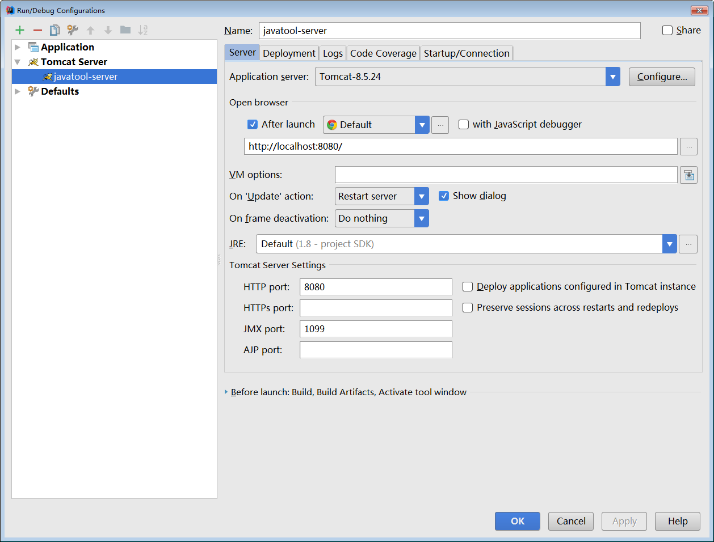

# Tomcat 快速入门

> 版本说明
>
> 本文使用 Tomcat 版本为 Tomcat 8.5.24。
>
> Tomcat 8.5 要求 JDK 版本为 1.7 以上。

## 简介

### Tomcat 是什么

Tomcat 是由 Apache 开发的一个 Servlet 容器，实现了对 Servlet 和 JSP 的支持，并提供了作为Web服务器的一些特有功能，如Tomcat管理和控制平台、安全域管理和Tomcat阀等。

由于 Tomcat 本身也内含了一个 HTTP 服务器，它也可以被视作一个单独的 Web 服务器。但是，不能将 Tomcat 和 Apache HTTP 服务器混淆，Apache HTTP 服务器是一个用 C 语言实现的 HTTP Web 服务器；这两个 HTTP web server 不是捆绑在一起的。Tomcat 包含了一个配置管理工具，也可以通过编辑XML格式的配置文件来进行配置。

### Tomcat 重要目录

- **/bin** - Tomcat 脚本存放目录（如启动、关闭脚本）。 `*.sh` 文件用于 Unix 系统； `*.bat` 文件用于 Windows 系统。
- **/conf** - Tomcat 配置文件目录。
- **/logs** - Tomcat 默认日志目录。
- **/webapps** - webapp 运行的目录。

### web 工程发布目录结构

一般 web 项目路径结构

```
|-- webapp                         # 站点根目录
    |-- META-INF                   # META-INF 目录
    |   `-- MANIFEST.MF            # 配置清单文件
    |-- WEB-INF                    # WEB-INF 目录
    |   |-- classes                # class文件目录
    |   |   |-- *.class            # 程序需要的 class 文件
    |   |   `-- *.xml              # 程序需要的 xml 文件
    |   |-- lib                    # 库文件夹
    |   |   `-- *.jar              # 程序需要的 jar 包
    |   `-- web.xml                # Web应用程序的部署描述文件
    |-- <userdir>                  # 自定义的目录
    |-- <userfiles>                # 自定义的资源文件
```
`webapp`：工程发布文件夹。其实每个 war 包都可以视为 webapp 的压缩包。

`META-INF`：META-INF 目录用于存放工程自身相关的一些信息，元文件信息，通常由开发工具，环境自动生成。

`WEB-INF`：Java web应用的安全目录。所谓安全就是客户端无法访问，只有服务端可以访问的目录。

`/WEB-INF/classes`：存放程序所需要的所有 Java class 文件。

`/WEB-INF/lib`：存放程序所需要的所有 jar 文件。

`/WEB-INF/web.xml`：web 应用的部署配置文件。它是工程中最重要的配置文件，它描述了 servlet 和组成应用的其它组件，以及应用初始化参数、安全管理约束等。

## 安装

**前提条件**

Tomcat 8.5 要求 JDK 版本为 1.7 以上。

进入 [Tomcat 官方下载地址](https://tomcat.apache.org/download-80.cgi) 选择合适版本下载，并解压到本地。

**Windows**

添加环境变量 `CATALINA_HOME` ，值为 Tomcat 的安装路径。

进入安装目录下的 bin 目录，运行 startup.bat 文件，启动 Tomcat

**Linux / Unix**

下面的示例以 8.5.24 版本为例，包含了下载、解压、启动操作。

```sh
# 下载解压到本地
wget http://mirrors.hust.edu.cn/apache/tomcat/tomcat-8/v8.5.24/bin/apache-tomcat-8.5.24.tar.gz
tar -zxf apache-tomcat-8.5.24.tar.gz
# 启动 Tomcat
./apache-tomcat-8.5.24/bin/startup.sh
```

启动后，访问 http://localhost:8080 ，可以看到 Tomcat 安装成功的测试页面。

## 配置

本节将列举一些重要、常见的配置项。详细的 Tomcat8 配置可以参考 [Tomcat 8 配置官方参考文档](http://tomcat.apache.org/tomcat-8.5-doc/config/index.html) 。

### Server

> Server 元素表示整个 Catalina servlet 容器。
>
> 因此，它必须是 `conf/server.xml` 配置文件中的根元素。它的属性代表了整个 servlet 容器的特性。

**属性表**

| 属性        | 描述                                       | 备注                                       |
| --------- | ---------------------------------------- | ---------------------------------------- |
| className | 这个类必须实现org.apache.catalina.Server接口。     | 默认 org.apache.catalina.core.StandardServer |
| address   | 服务器等待关机命令的TCP  / IP地址。如果没有指定地址，则使用localhost。 |                                          |
| port      | 服务器等待关机命令的TCP / IP端口号。设置为-1以禁用关闭端口。      |                                          |
| shutdown  | 必须通过TCP / IP连接接收到指定端口号的命令字符串，以关闭Tomcat。  |                                          |

### Service

> Service元素表示一个或多个连接器组件的组合，这些组件共享一个用于处理传入请求的引擎组件。Server 中可以有多个 Service。

**属性表**

| 属性        | 描述                                       | 备注                                       |
| --------- | ---------------------------------------- | ---------------------------------------- |
| className | 这个类必须实现`org.apache.catalina.Service`接口。  | 默认 `org.apache.catalina.core.StandardService` |
| name      | 此服务的显示名称，如果您使用标准 Catalina  组件，将包含在日志消息中。与特定服务器关联的每个服务的名称必须是唯一的。 |                                          |

**实例 - `conf/server.xml` 配置文件示例**

```xml
<?xml version="1.0" encoding="UTF-8"?>
<Server port="8080" shutdown="SHUTDOWN">
  <Service name="xxx">
  ...
  </Service>
</Server>
```

### Executor

> Executor表示可以在Tomcat中的组件之间共享的线程池。
>

**属性表**

| 属性              | 描述                                       | 备注                                       |
| --------------- | ---------------------------------------- | ---------------------------------------- |
| className       | 这个类必须实现`org.apache.catalina.Executor`接口。 | 默认 `org.apache.catalina.core.StandardThreadExecutor` |
| name            | 线程池名称。                                   | 要求唯一,  供Connector元素的executor属性使用         |
| namePrefix      | 线程名称前缀。                                  |                                          |
| maxThreads      | 最大活跃线程数。                                 | 默认200                                    |
| minSpareThreads | 最小活跃线程数。                                 | 默认25                                     |
| maxIdleTime     | 当前活跃线程大于minSpareThreads时,空闲线程关闭的等待最大时间。  | 默认60000ms                                |
| maxQueueSize    | 线程池满情况下的请求排队大小。                          | 默认Integer.MAX_VALUE                      |

```xml
<Service name="xxx">
  <Executor name="tomcatThreadPool" namePrefix="catalina-exec-" maxThreads="300" minSpareThreads="25"/>
</Service>
```

### Connector

> Connector代表连接组件。Tomcat 支持三种协议：HTTP/1.1、HTTP/2.0、AJP。

**属性表**

| 属性                    | 说明                                       | 备注                                       |
| --------------------- | ---------------------------------------- | ---------------------------------------- |
| asyncTimeout          | Servlet3.0规范中的异步请求超时                     | 默认30s                                    |
| port                  | 请求连接的TCP Port                            | 设置为0,则会随机选取一个未占用的端口号                     |
| protocol              | 协议. 一般情况下设置为 HTTP/1.1,这种情况下连接模型会在NIO和APR/native中自动根据配置选择 |                                          |
| URIEncoding           | 对URI的编码方式.                               | 如果设置系统变量org.apache.catalina.STRICT_SERVLET_COMPLIANCE为true,使用 ISO-8859-1编码;如果未设置此系统变量且未设置此属性, 使用UTF-8编码 |
| useBodyEncodingForURI | 是否采用指定的contentType而不是URIEncoding来编码URI中的请求参数 |                                          |

以下属性在标准的Connector(NIO, NIO2 和 APR/native)中有效:

| 属性                | 说明                                       | 备注                                       |
| ----------------- | ---------------------------------------- | ---------------------------------------- |
| acceptCount       | 当最大请求连接maxConnections满时的最大排队大小           | 默认100,注意此属性和Executor中属性maxQueueSize的区别.这个指的是请求连接满时的堆栈大小,Executor的maxQueueSize指的是处理线程满时的堆栈大小 |
| connectionTimeout | 请求连接超时                                   | 默认60000ms                                |
| executor          | 指定配置的线程池名称                               |                                          |
| keepAliveTimeout  | keeAlive超时时间                             | 默认值为connectionTimeout配置值.-1表示不超时         |
| maxConnections    | 最大连接数                                    | 连接满时后续连接放入最大为acceptCount的队列中. 对 NIO和NIO2连接,默认值为10000;对 APR/native,默认值为8192 |
| maxThreads        | 如果指定了Executor, 此属性忽略;否则为Connector创建的内部线程池最大值 | 默认200                                    |
| minSpareThreads   | 如果指定了Executor, 此属性忽略;否则为Connector创建线程池的最小活跃线程数 | 默认10                                     |
| processorCache    | 协议处理器缓存Processor对象的大小                    | -1表示不限制.当不使用servlet3.0的异步处理情况下: 如果配置Executor,配置为Executor的maxThreads;否则配置为Connnector的maxThreads. 如果使用Serlvet3.0异步处理, 取maxThreads和maxConnections的最大值 |

### Context

> Context元素表示一个Web应用程序，它在特定的虚拟主机中运行。每个Web应用程序都基于Web应用程序存档（WAR）文件，或者包含相应的解包内容的相应目录，如Servlet规范中所述。

**属性表**

| 属性                         | 说明                                       | 备注                              |
| -------------------------- | ---------------------------------------- | ------------------------------- |
| altDDName                  | web.xml部署描述符路径                           | 默认 /WEB-INF/web.xml             |
| docBase                    | Context的Root路径                           | 和Host的appBase相结合, 可确定web应用的实际目录 |
| failCtxIfServletStartFails | 同Host中的failCtxIfServletStartFails, 只对当前Context有效 | 默认为false                        |
| logEffectiveWebXml         | 是否日志打印web.xml内容(web.xml由默认的web.xml和应用中的web.xml组成) | 默认为false                        |
| path                       | web应用的context path                       | 如果为根路径,则配置为空字符串(""), 不能不配置      |
| privileged                 | 是否使用Tomcat提供的manager servlet             |                                 |
| reloadable                 | /WEB-INF/classes/ 和/WEB-INF/lib/ 目录中class文件发生变化是否自动重新加载 | 默认为false                        |
| swallowOutput              | true情况下, System.out和System.err输出将被定向到web应用日志中 | 默认为false                        |

### Engine

> Engine元素表示与特定的Catalina服务相关联的整个请求处理机器。它接收并处理来自一个或多个连接器的所有请求，并将完成的响应返回给连接器，以便最终传输回客户端。

**属性表**

| 属性          | 描述                                       | 备注                                |
| ----------- | ---------------------------------------- | --------------------------------- |
| defaultHost | 默认主机名，用于标识将处理指向此服务器上主机名称但未在此配置文件中配置的请求的主机。 | 这个名字必须匹配其中一个嵌套的主机元素的名字属性。         |
| name        | 此引擎的逻辑名称，用于日志和错误消息。                      | 在同一服务器中使用多个服务元素时，每个引擎必须分配一个唯一的名称。 |

### Host

> Host元素表示一个虚拟主机，它是一个服务器的网络名称（如“www.mycompany.com”）与运行Tomcat的特定服务器的关联。
>

**属性表**

| 属性                         | 说明                                       | 备注                              |
| -------------------------- | ---------------------------------------- | ------------------------------- |
| name                       | 名称                                       | 用于日志输出                          |
| appBase                    | 虚拟主机对应的应用基础路径                            | 可以是个绝对路径, 或${CATALINA_BASE}相对路径 |
| xmlBase                    | 虚拟主机XML基础路径,里面应该有Context xml配置文件         | 可以是个绝对路径, 或${CATALINA_BASE}相对路径 |
| createDirs                 | 当appBase和xmlBase不存在时,是否创建目录              | 默认为true                         |
| autoDeploy                 | 是否周期性的检查appBase和xmlBase并deploy web应用和context描述符 | 默认为true                         |
| deployIgnore               | 忽略deploy的正则                              |                                 |
| deployOnStartup            | Tomcat启动时是否自动deploy                      | 默认为true                         |
| failCtxIfServletStartFails | 配置为true情况下,任何load-on-startup >=0的servlet启动失败,则其对应的Contxt也启动失败 | 默认为false                        |

### Cluster

由于在实际开发中，我从未用过Tomcat集群配置，所以没研究。

## 启动

### 部署方式

这种方式要求本地必须安装 Tomcat 。

将打包好的 war 包放在 Tomcat 安装目录下的 `webapps` 目录下，然后在 bin 目录下执行 `startup.bat` 或 `startup.sh` ，Tomcat 会自动解压 `webapps` 目录下的 war 包。

成功后，可以访问 http://localhost:8080/xxx （xxx 是 war 包文件名）。

> **注意**
>
> 以上步骤是最简单的示例。步骤中的 war 包解压路径、启动端口以及一些更多的功能都可以修改配置文件来定制 （主要是 `server.xml` 或 `context.xml` 文件）。

### 嵌入式

#### API 方式

在 pom.xml 中添加依赖

```xml
<dependency>
  <groupId>org.apache.tomcat.embed</groupId>
  <artifactId>tomcat-embed-core</artifactId>
  <version>8.5.24</version>
</dependency>
```

添加 SimpleEmbedTomcatServer.java 文件，内容如下：

```java
import java.util.Optional;
import org.apache.catalina.startup.Tomcat;

public class SimpleTomcatServer {
    private static final int PORT = 8080;
    private static final String CONTEXT_PATH = "/javatool-server";

    public static void main(String[] args) throws Exception {
        // 设定 profile
        Optional<String> profile = Optional.ofNullable(System.getProperty("spring.profiles.active"));
        System.setProperty("spring.profiles.active", profile.orElse("develop"));

        Tomcat tomcat = new Tomcat();
        tomcat.setPort(PORT);
        tomcat.getHost().setAppBase(".");
        tomcat.addWebapp(CONTEXT_PATH, getAbsolutePath() + "src/main/webapp");
        tomcat.start();
        tomcat.getServer().await();
    }

    private static String getAbsolutePath() {
        String path = null;
        String folderPath = SimpleEmbedTomcatServer.class.getProtectionDomain().getCodeSource().getLocation().getPath()
                .substring(1);
        if (folderPath.indexOf("target") > 0) {
            path = folderPath.substring(0, folderPath.indexOf("target"));
        }
        return path;
    }
}
```

成功后，可以访问 http://localhost:8080/javatool-server 。

> **说明**
>
> 本示例是使用 `org.apache.tomcat.embed` 启动嵌入式 Tomcat 的最简示例。
>
> 这个示例中使用的是 Tomcat 默认的配置，但通常，我们需要对 Tomcat 配置进行一些定制和调优。为了加载配置文件，启动类就要稍微再复杂一些。这里不想再贴代码，有兴趣的同学可以参考：
>
> [**示例项目**](https://github.com/dunwu/java-stack/tree/master/codes/javatool/server)

#### 使用 maven 插件启动（不推荐）

不推荐理由：这种方式启动 maven 虽然最简单，但是有一个很大的问题是，真的很久很久没发布新版本了（最新版本发布时间：2013-11-11）。且貌似只能找到 Tomcat6 、Tomcat7 插件。

**使用方法**

在 pom.xml 中引入插件

```xml
<plugin>
  <groupId>org.apache.tomcat.maven</groupId>
  <artifactId>tomcat7-maven-plugin</artifactId>
  <version>2.2</version>
  <configuration>
    <port>8080</port>
    <path>/${project.artifactId}</path>
    <uriEncoding>UTF-8</uriEncoding>
  </configuration>
</plugin>
```

运行 `mvn tomcat7:run` 命令，启动 Tomcat。

成功后，可以访问 http://localhost:8080/xxx （xxx 是 ${project.artifactId} 指定的项目名）。

### IDE 插件

常见 Java IDE 一般都有对 Tomcat 的支持。

以 Intellij IDEA 为例，提供了 **Tomcat and TomEE Integration** 插件（一般默认会安装）。

**使用步骤**

- 点击 Run/Debug Configurations > New Tomcat Server > local ，打开 Tomcat 配置页面。
- 点击 Confiure... 按钮，设置 Tomcat 安装路径。
- 点击 Deployment 标签页，设置要启动的应用。
- 设置启动应用的端口、JVM 参数、启动浏览器等。
- 成功后，可以访问 http://localhost:8080/（当然，你也可以在 url 中设置上下文名称）。



> **说明**
>
> 个人认为这个插件不如 Eclipse 的 Tomcat 插件好用，Eclipse 的 Tomcat 插件支持对 Tomcat xml 配置文件进行配置。而这里，你只能自己去 Tomcat 安装路径下修改配置文件。

## 资料

- [Tomcat 官方网站](http://tomcat.apache.org/)
- [Tomcat Wiki](http://wiki.apache.org/tomcat/FrontPage)
- [Tomee 官方网站](http://tomee.apache.org/)
- [Creating a Web App with Bootstrap and Tomcat Embedded](http://www.oracle.com/webfolder/technetwork/tutorials/obe/java/basic_app_embedded_tomcat/basic_app-tomcat-embedded.html)

## 推荐

文中的嵌入式启动示例可以参考[**我的示例项目**](https://github.com/dunwu/java-stack/tree/master/codes/javatool/server)